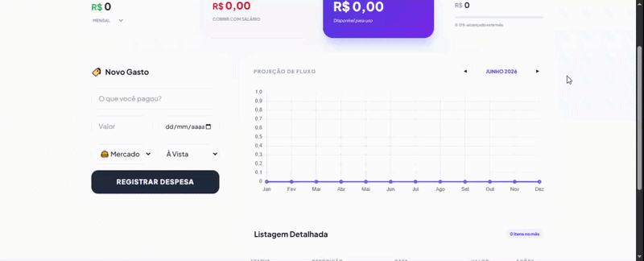

# 💰 App de Fluxo de Caixa

Este é um projeto de gestão financeira pessoal desenvolvido para colocar em prática conceitos de manipulação de DOM, lógica de programação com JavaScript e design responsivo. 

> **Status do Projeto:** 🚀 Concluído / Em desenvolvimento

## 🔗 Demonstração
Acesse o projeto funcionando aqui: <https://finance-app-frontend-376scmoe3-dayvidarrudas-projects.vercel.app/>

## 🛠️ Tecnologias Utilizadas
As seguintes ferramentas foram usadas na construção do projeto:
- **HTML5**: Estruturação semântica.
- **CSS3**: Estilização com Flexbox e Grid.
- **JavaScript**: Lógica de cálculos e manipulação de elementos.

## 📱 Funcionalidades
- [x] Adicionar transações (Entradas e Saídas).
- [x] Cálculo automático de saldo, receitas e despesas.
- [x] Persistência de dados (opcional se você usou LocalStorage).
- [x] Layout responsivo para dispositivos móveis.

## 🎨 Layout

## ✒️ Autor
Desenvolvido por **Dayvid Arruda**.
